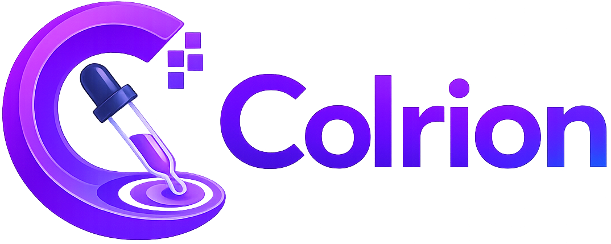
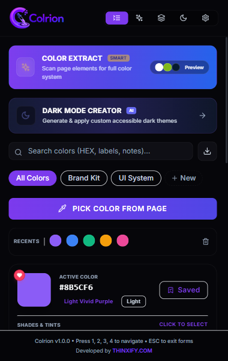
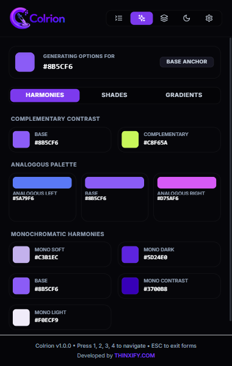
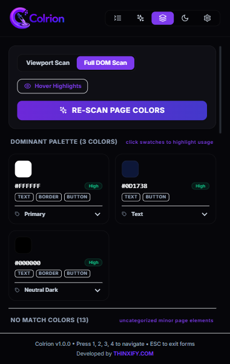
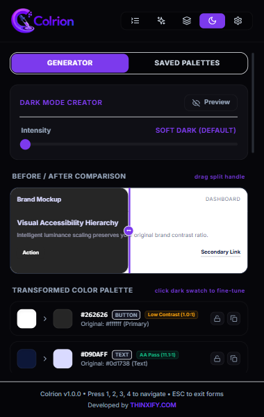
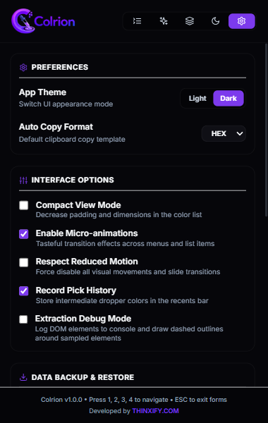
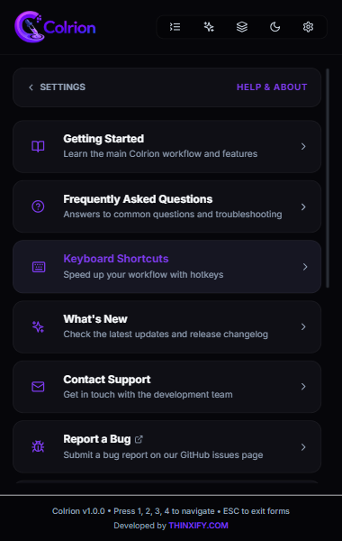

<div align="center">



### A premium, modern color picker for the web.

Pick, extract, generate, and organize colors from any webpage — right from your Chrome toolbar.

[](https://chromewebstore.google.com/detail/colrion/hblhldfgdnnmmgnoieeafcplnmhmpple)
[](#license)
[](public/manifest.json)
[](https://react.dev)

</div>

---

## Install

The fastest way to get started — install Colrion directly from the **Chrome Web Store**:

<div align="center">

### 👉 [**Install Colrion from the Chrome Web Store**](https://chromewebstore.google.com/detail/colrion/hblhldfgdnnmmgnoieeafcplnmhmpple) 👈

</div>

Prefer to build it yourself? See [Development & Setup](#development--setup) below for running it locally as an unpacked extension.

---

## Overview

**Colrion** is a premium browser extension built for developers and designers who work with color every day. Pick any pixel color from a webpage, preview it instantly, copy the HEX/RGB/HSL codes, extract an entire site's design system, generate an accessible dark mode, and keep everything organized in custom palettes — all stored privately on your device.

Built with **React**, **TypeScript**, **Tailwind CSS**, **Vite**, and **Chrome Extension Manifest V3**.

---

## Screenshots

<div align="center">

| Colors Dashboard | Smart Related Colors |
|:---:|:---:|
|  |  |

| Page Color Extractor | Dark Mode Generator |
|:---:|:---:|
|  |  |

| Settings | Help Center |
|:---:|:---:|
|  |  |

</div>

---

## Features

| | |
|---|---|
| 🎯 **EyeDropper Integration** | Pick any pixel color from a webpage using Chrome's native EyeDropper API. |
| 🧠 **Intelligent Page Color Extractor** | Scans a page's stylesheets and DOM hierarchy to extract its actual design system colors. Uses K-Means clustering and perceptual RGB distance classification to group colors into a "Dominant Palette" (background, text, primary, secondary, accents) and isolates minor colors under "No Match Colors". |
| 🌙 **Vibrant Dark Mode Generator** | Automatically generates a high-contrast, accessible dark mode palette from any scanned light-themed webpage using HSL rotation, relative luminance mapping, and adjustable intensity profiles (Pitch Black, Modern Dark, Deep Slate). |
| 🔖 **Visual Color Tone Identifier** | Automatically classifies a selected color's lightness into a clean tone category (Very Light, Light, Medium, Dark, Deep). |
| 🌗 **Dynamic Theming** | Instant runtime Light/Dark theme switching via CSS variable classes, integrated with Tailwind CSS. |
| 🎨 **Smart Related Colors** | Generates shades, complementary, analogous, and monochromatic color harmonies from any selected color. |
| 🌈 **CSS Linear Gradients** | Pairs your active color with matching variants to render linear gradients — copy the CSS rule or save both colors instantly. |
| 🖱️ **Drag-to-Reorder Sorting** | Reorder saved colors and palettes by dragging. Order persists automatically across browser restarts. |
| 💾 **JSON Backup Import/Export** | Securely export your entire database (colors, palettes, settings) as a JSON file, or restore a backup with schema-merge verification. |
| ⭐ **Favorites & Custom Palettes** | Star your favorite colors and organize collections into unlimited custom palettes. |
| 📖 **Built-in Help Center** | Getting Started guide, FAQ, changelog, keyboard shortcuts, and one-click bug/feature report templates — all inside the popup. |

### Keyboard Shortcuts

| Key | Action |
|:---:|---|
| `1` | Switch to **Colors** view |
| `2` | Switch to **Generator** view |
| `3` | Switch to **Extract** view |
| `4` | Switch to **Settings** view |
| `5` | Switch to **Dark Mode** view |
| `P` | Trigger the EyeDropper |
| `F` | Toggle Favorites-only filter (Colors view) |
| `Esc` | Close menus, cancel forms, blur inputs |

---

## Tech Stack

- **Framework:** React 18
- **Language:** TypeScript
- **Styling:** Tailwind CSS & vanilla CSS
- **State Management:** Zustand
- **Icons:** Lucide React
- **Build System:** Vite
- **Platform:** Chrome Extension Manifest V3

---

## File Structure

```text
/
├── package.json               # Dependencies and scripts
├── tsconfig.json              # TypeScript configuration
├── vite.config.ts             # Vite configuration with relative assets base path
├── tailwind.config.js         # Custom dark-first theme settings mapped to CSS variables
├── postcss.config.js          # PostCSS configuration for Tailwind
├── index.html                 # Main popup entry document
├── public/
│   ├── manifest.json          # Chrome Extension Manifest V3 configuration
│   ├── logo.png                # Brand logo
│   └── icon16/32/48/128.png    # Extension icon set
├── scripts/
│   └── generate-icons.js      # Programmatic script to generate icons from base64
└── src/
    ├── app/
    │   └── App.tsx             # App container (view orchestrator & hotkey listener)
    ├── components/
    │   ├── Button.tsx           # Reusable styled button component
    │   ├── Header.tsx           # Branded header with segmented navigation tabs
    │   ├── ColorPreview.tsx     # Swatch card with copy badges, palette selector & favorite toggle
    │   ├── ColorList.tsx        # Draggable list supporting compact mode & favorites filter
    │   ├── ColorGenerator.tsx   # Suggestions panel (harmonies, shades, gradients)
    │   ├── ExtractView.tsx      # Page color scanning & extraction panel
    │   ├── DarkModeView.tsx     # Dark mode palette generator panel
    │   ├── DarkModePaletteCard.tsx # Individual generated dark palette card
    │   ├── SettingsView.tsx     # Option toggles, backups export, and schema file import
    │   └── HelpView.tsx         # Help center: guide, FAQ, shortcuts, changelog & support
    ├── lib/
    │   ├── clustering.ts        # K-Means clustering and perceptual distance role categorization
    │   ├── color.ts              # Hex/RGB/HSL conversion and tone utility helpers
    │   ├── colorUtils.ts         # Mathematical harmony rotations and gradient generation
    │   ├── darkModeGenerator.ts  # HSL rotation & luminance mapping for dark theme generation
    │   ├── extractScript.ts      # Injected content script for scanning page DOM/CSS colors
    │   └── storage.ts            # Chrome storage local API with localStorage fallback & migration
    ├── store/
    │   └── useColorStore.ts     # Zustand state store managing pickers, CRUD, settings & sorting
    ├── config/
    │   └── product.ts            # Product metadata (links, support email, store URL, etc.)
    ├── types/
    │   └── index.ts              # Shared TypeScript interfaces
    ├── index.css                 # Custom theme CSS variables, animations, and scrollbars
    └── main.tsx                  # React mount script
```

---

## Development & Setup

### Prerequisites
[Node.js](https://nodejs.org/) v18 or later.

### 1. Clone the repository
```bash
git clone https://github.com/THINXIFY/colrion-chrome-extension.git
cd colrion-chrome-extension
```

### 2. Install dependencies
```bash
npm install
```

### 3. Run in a local browser tab (development mode)
Test search, inline edits, and palettes without loading the extension:
```bash
npm run dev
```

### 4. Build for production
```bash
npm run build
```
This compiles the TypeScript code, builds Tailwind CSS, and outputs the production bundle to the `dist/` directory.

### 5. Load the unpacked extension into Chrome
1. Open **Google Chrome** and navigate to `chrome://extensions/`.
2. Enable **Developer mode** using the toggle in the top-right corner.
3. Click **Load unpacked**.
4. Select the **`dist`** directory inside the project root.
5. The Colrion icon will appear in your extensions list — pin it to your toolbar for quick access!

---

## Permissions & Privacy

Colrion operates under strict privacy and permissions hygiene:

| Permission | Purpose |
|---|---|
| `activeTab` | Temporary host page access, used purely to inject success toast notifications and drive color extraction on the active tab. |
| `scripting` | Required to inject the color sampler and toast elements into the host page for immediate user feedback. |
| `storage` | Used to persist themes, settings, recent picks, custom palettes, and saved swatches locally. |

**No external network requests are made, no accounts are required, and no user data is ever collected or transmitted.** Everything Colrion stores lives locally in your browser via `chrome.storage.local`.

---

## Roadmap

- **Palette Syncing** — connect to cloud databases (e.g. Firebase) to sync color libraries across devices.
- **Design Tool Exports** — Figma plugin API / Adobe Creative Cloud integration using the existing JSON backup payload schema.

---

## Contributing

Bug reports and feature requests are welcome — please [open an issue](https://github.com/THINXIFY/colrion-chrome-extension/issues/new) on GitHub, or use the built-in **Report a Bug** / **Request a Feature** actions inside the extension's Help panel.

---

## License

Released under the **MIT License**.

Developed by [**THINXIFY**](https://thinxify.com).

---

## Release Notes

### Version 1.0.0 — Initial Production Release
- **EyeDropper Integration** — on-demand pixel color picking with clipboard sync and success toasts.
- **Intelligent Page Color Extractor** — scans DOM elements and stylesheets using K-Means clustering to build a design system palette.
- **Vibrant Dark Mode Generator** — HSL space rotation and relative luminance mapping to auto-generate dark mode variants.
- **Tone Category Classifier** — automatic tone identification (Very Light, Light, Medium, Dark, Deep) on preview swatches.
- **Draggable Reordering** — full drag-and-drop sorting for custom palettes and saved colors.
- **Backup & Settings** — schema-validated JSON backup import/export, accessibility settings, and theme toggling.
- **Help Center** — in-app Getting Started guide, FAQ, changelog, and support/report shortcuts.

---

<div align="center">

**[⭐ Install Colrion from the Chrome Web Store](https://chromewebstore.google.com/detail/colrion/hblhldfgdnnmmgnoieeafcplnmhmpple)**

</div>
